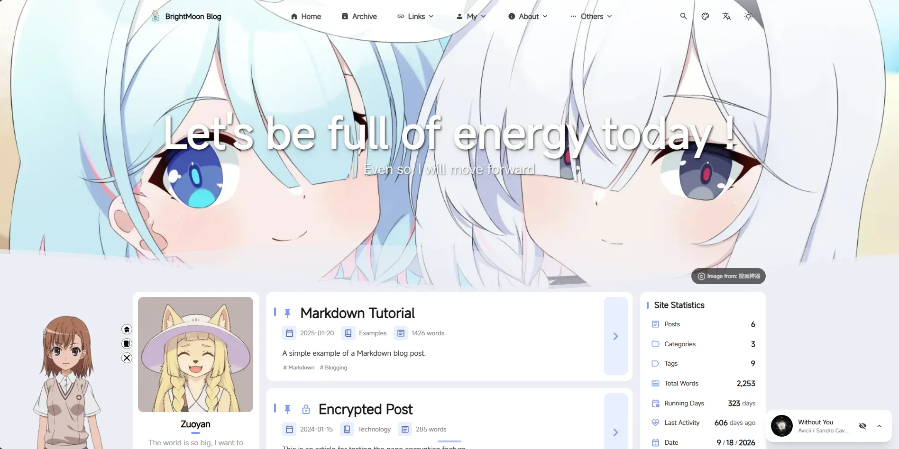

# BrightMoon


BrightMoon は、モダンなミニマリズムと優雅さを融合した、獨特の二次元美學を備えた靜態ブログテンプレートです。[Astro](https://astro.build/) を基盤とし、先進的な機能と洗練されたビジュアルを一つに統合しています。

***明月初めて昇るが如く、清らかな輝きは変わらず*** </br>
***此処を始まりとし、新たに出発せん。***

[](https://nodejs.org/)
[](https://pnpm.io/)
[](https://astro.build/)
[](https://www.typescriptlang.org/)
[](https://opensource.org/licenses/Apache-2.0)

💻 私のウェブサイトへようこそ：[こちらをクリック](https://www.zuoyanblogs.xyz/)

🌐 README 言語：[繁體中文](./README.zh_Hant.md) &nbsp; [简体中文](./README.zh_CN.md) &nbsp; [English](./README.en.md)



<table>
  <tr>
    <td></td>
    <td></td>
    <td></td>
  <tr>
  <tr>
    <td></td>
    <td></td>
    <td></td>
  <tr>
  <tr>
    <td></td>
    <td></td>
    <td></td>
  <tr>
</table>

---

## 🔄 本プロジェクトの更新頻度

不定期に Mizuki テーマフレームワークのメインラインコンテンツを同期更新します。将来的には、フレームワーク機能をベースにカスタマイズ修正を加える予定であり、バージョン番号には `BrightMoon Custom Edition (CE)` のサフィックスを付与し、BrightMoon による軽度カスタマイズバージョンであることを示します。（現在流行のウェブサイトフレームワークを猛勉強中です。時間があるときに取り組む予定です、ううう～～～）

---

## 🛠 本プロジェクトにおける魔改造内容

- 10カ国のサイト言語テキストを追加。将来的なサイト更新に合わせて言語テキストも同時更新。
- 多言語国際翻訳コンポーネントを追加：
  - 翻訳パネルスタイルに適応するため、`mobile-navbar` スタイルシートを魔改造。
- カレンダースタイルを変更し、最も快適な外観に魔改造：
  - 左右切り替えアイコンを変更。
  - 記事投稿日の下部にある小さなドットの位置を調整。
  - 同じ日に複数の記事がある場合の右上数字サイズを調整。
- フィードバックページを追加し、サイト管理者への連絡方法を統合。
- スポンサーページを追加し、決済用QRコード配置パスを統合。
- サイト統計にリアルタイムの日付、季節、時刻を追加。日付と季節は複数の地域形式に対応し、時刻は時間帯表示に対応する。
- 外部リンク確認ポップアップを追加し、一部スタイルを魔改造。
- ページのスクロールバーのスタイルを追加。
- パーソナライズ設定を再構築し、壁紙モード、桜のエフェクト、記事一覧レイアウト、ナビゲーションバースタイルのUIコントロールを新たに追加しました。
- 「システムに従う」テーマモードを追加し、ドロップダウンリストでテーマを選択可能に。
- bangumi と bilibili の設定を anime 設定項目の下に統合。
- 最新バージョンの Twikoo コメントシステムを更新・適応。
- TOC目次がレスポンシブデバイス設定に対応。
- 隠しアルバムロジックを再構築し、リンク経由でアクセスできない問題を修正。
- 一部ウィジェットのアニメーションを最適化。

---

## ✨ 機能特性

Mizuki の機能詳細については、こちらをご覧ください：<a href="https://docs.mizuki.mysqil.com/" target="_blank">Mizuki Docs 公式サイト</a>

### 🔧 コンポーネント設定システムの再構築

- **統一設定アーキテクチャ：** 動的コンポーネント管理と順序設定をサポートする、新しいモジュール式コンポーネント設定システム。
- **設定駆動型コンポーネントロード：** SideBar コンポーネントを再構築し、完全に設定ベースのコンポーネントロードメカニズムを実現。
- **統一制御スイッチ：** 音楽プレーヤーとお知らせコンポーネントの個別 `enable` スイッチを廃止し、`sidebarLayoutConfig` による一元管理に統一。
- **レスポンシブレイアウト対応：** コンポーネントがレスポンシブレイアウトをサポートし、デバイスタイプに応じて自動的に表示を調整。

### 📐 レイアウトシステムの最適化

- **サイドバー位置の動的調整：** 左右サイドバーの切り替えに対応し、レイアウトが自動適応。
- **記事目次のインテリジェント配置：** サイドバーが右側にある場合、記事ナビゲーションは自動的に左側に移動し、より優れた読書体験を提供。
- **グリッドレイアウトの改善：** CSS Grid レイアウトを最適化し、コンテナ幅の異常問題を解決。

### 🎛️ 設定ファイルフォーマットの標準化

- **標準化された設定フォーマット：** 統一されたコンポーネント設定ファイルフォーマット仕様を作成。
- **型安全性：** 完璧な TypeScript 型定義により、設定の型安全性を確保。
- **拡張性：** カスタムコンポーネントタイプと設定オプションをサポート。

### 🧹 コード最適化

- **テストファイルのクリーンアップ：** 未使用のテスト設定と依存関係を削除し、プロジェクト容量を削減。
- **コード構造の最適化：** コンポーネントアーキテクチャを改善し、コードの保守性を向上。
- **パフォーマンス向上：** コンポーネントロードロジックを最適化し、ページレンダリングパフォーマンスを向上。

### 🎨 デザインとインターフェース

- [Astro](https://astro.build) と [Tailwind CSS](https://tailwindcss.com) に基づいて構築。
- [Swup](https://swup.js.org/) を使用したスムーズなアニメーションとページ遷移。
- システム設定検出をサポートするライト/ダークテーマ切り替え。
- カスタマイズ可能なテーマカラーと動的バナーカルーセル。
- 透明度とブラー効果をサポートするフルスクリーン背景画像。
- 全デバイス対応レスポンシブデザイン。
- JetBrains Mono フォントによる美しいタイポグラフィ。

### 🔍 コンテンツと検索

- [Pagefind](https://pagefind.app/) に基づく高度な検索機能。
- シンタックスハイライトをサポートする[強化された Markdown 機能](https://docs.mizuki.mysqil.com/press/Markdown/Markdown/)。
- 自動スクロールをサポートするインタラクティブな目次。
- RSS および Atom フィード生成。
- 読了時間の推定。
- 記事カテゴリとタグシステム。

### 📱 特徴的なページ

- **アニメページ** - アニメ視聴進捗と評価を追跡。
- **友達リンクページ** - 友人サイトを美しいカードで表示。
- **アルバムページ** - 生活の中の素敵な瞬間を記録。
- **デバイスページ** - 使用デバイス情報を表示。
- **ダイアリーページ** - SNS感覚で日常の瞬間を共有。
- **アーカイブページ** - 整然とした記事タイムラインビュー。
- **アバウトページ** - カスタマイズ可能な自己紹介。
- **スポンサーページ** - サイト管理者を支援し、良質な創作を応援。
- **フィードバックページ** - サイトへの意見・提案を提出し、管理者と直接コミュニケーション。
- **プロジェクト紹介ページ** - 開発プロジェクトのポートフォリオ。
- **スキル紹介ページ** - 技術スキルと専門知識。
- **タイムラインページ** - 成長の過程と重要なマイルストーン。

### 🛠 技術特性

- **強化されたコードブロック** - [Expressive Code](https://expressive-code.com/) に基づく。
- **数式サポート** - KaTeX レンダリング。
- **画像最適化** - PhotoSwipe ギャラリー統合。
- **SEO 最適化** - サイトマップとメタタグを含む。
- **パフォーマンス最適化** - 遅延読み込みとキャッシュメカニズム。
- **コメントシステム** - Twikoo 統合をサポート。
- **翻訳コンポーネント** - ローカル i18n 言語ライブラリ + translate.js を採用し、ミリ秒単位の翻訳を実現。

---

## ⚡ プロジェクトの実行方法

1. **リポジトリのクローン：**

```bash

git clone https://github.com/Zuoyan233/BrightMoon.git

cd BrightMoon

```

2. **依存関係をインストール:**

```bash
# pnpm がインストールされていない場合は、まずインストールしてください
npm install -g pnpm

# プロジェクトの依存関係をインストール
pnpm install

```

3. **ブログの設定：**

- `src/config.ts` を編集してブログ設定をカスタマイズします。
- サイト情報、テーマカラー、バナー画像、ソーシャルリンクを更新します。
- 特徴的なページ機能を設定します。
- (オプション) コンテンツリポジトリの分離設定 - 詳細は Mizuki Docs の [コンテンツリポジトリ設定](https://docs.mizuki.mysqil.com/Other/separation/) をご覧ください。

4. **特徴的なページ設定：**

- **アニメページ：** `src/pages/anime.astro` でアニメリストを編集します。
- **友達リンクページ：** `src/content/spec/friends.md` で友達データを編集します。
- **アルバムページ：** `public/images/albums` でアルバム情報を編集します。使用方法は [アルバム機能の使用説明](./public/images/albums/README.md) をご覧ください。
- **デバイスページ：** `src/data/devices.ts` でデバイス情報を編集します。
- **ダイアリーページ：** `src/data/diary.ts` で投稿を編集します。
- **アバウトページ：** `src/content/spec/about.md` でコンテンツを編集します。
- **スポンサーページ：** `src/content/spec/sponsors.md` でコンテンツを編集します。
  - `src/config.ts` 内の `addpaymentConfig` で決済用QRコードを設定します。QRコード画像の保存先は `public/images/sponsors` 内です。
- **フィードバックページ：** `src/content/spec/feedback.md` でコンテンツを編集します。
  - `src/config.ts` 内の `contactEmailConfig` でサイト管理者のメールアドレス連絡先を設定します。
  - `src/config.ts` 内にある `addfriendConfig` 設定で友達追加用のQRコードを追加します。QRコードのファイルパスは `public/images/contact` 内に格納されています。
- **プロジェクト紹介ページ：** `src/data/projects.ts` で表示コンテンツを編集します。
- **スキル紹介ページ：** `src/data/skills.ts` で表示コンテンツを編集します。
- **タイムラインページ：** `src/data/timeline.ts` で表示コンテンツを編集します。

5. **記事コンテンツ管理：**

- **新規記事作成：** `pnpm new-post <ファイル名>` を実行します。
- **記事編集：** `src/content/posts/` 内のファイルを修正します。
- **カスタムページ：** `src/content/spec/` 内の特殊ページを編集します。
- **画像追加：** 画像を `src/assets/` または `public/` に配置します。
- **Markdown 拡張構文:** 詳細は Mizuki Docs の [Markdown 拡張構文](https://docs.mizuki.mysqil.com/press/Markdown/customize/) をご覧ください。

**Frontmatter フィールド説明：**

- **title**: 記事タイトル（必須）
- **published**: 公開日（必須）
- **description**: 記事の説明、SEOおよびプレビュー用
- **image**: カバー画像パス（記事ファイルからの相対パス）
- **tags**: 分類用タグ配列
- **category**: 記事カテゴリ
- **draft**: `true` に設定すると、本番環境で記事を非表示にします
- **comment**: `true` または `false` に設定すると、現在の記事のコメントON/OFFを制御します（事前に `src/config.ts` で Twikoo コメントシステムを有効にする必要があります）
- **pinned**: `true` に設定すると記事をトップに固定します
- **lang**: 記事の言語（サイトデフォルト言語と異なる場合のみ設定します）

6. **開発サーバーの起動：**

   ```bash
   pnpm dev
   ```

   ブログは `http://localhost:4321` で利用可能になります。

7. **全コマンドはプロジェクトルートディレクトリで実行します：**

| コマンド                     | 操作                                        |
| :--------------------------- | :------------------------------------------ |
| `pnpm install`               | 依存関係のインストール                      |
| `pnpm dev`                   | `localhost:4321` でローカル開発サーバー起動 |
| `pnpm build`                 | 本番サイトを `./dist/` にビルド             |
| `pnpm preview`               | デプロイ前にローカルでビルドをプレビュー    |
| `pnpm check`                 | Astro エラーチェック実行                    |
| `pnpm format`                | Biome を使用してコードフォーマット          |
| `pnpm lint`                  | コード問題のチェックと修正                  |
| `pnpm new-post <ファイル名>` | 新規ブログ記事作成                          |
| `pnpm astro ...`             | Astro CLI コマンド実行                      |

---

## 🙏 謝辞

- [Mizuki](https://github.com/matsuzaka-yuki/Mizuki) - Fuwari に基づく二次開発強化版。モダンで多機能な静的ブログテンプレートを提供してくださり感謝します。
- [Fuwari](https://github.com/saicaca/fuwari) by saicaca - 本プロジェクトの基盤となったオリジナルテンプレート。このように美しく強力なテンプレートを作成してくださり感謝します。
- [Yukina](https://github.com/WhitePaper233/yukina) - 本プロジェクトの形成に寄与したデザインインスピレーションとアイデアを提供してくださり感謝します。Yukina は優れたデザイン原則とユーザーエクスペリエンスを示す、エレガントなブログテンプレートです。
- [Firefly](https://github.com/CuteLeaf/Firefly) - 両側サイドバーレイアウト、記事二列グリッドなどの優れたレイアウトデザインアイデア、および一部ウィジェットの設計と実装を提供してくださり感謝します。
- [Twilight](https://github.com/spr-aachen/Twilight) - インスピレーションと技術サポートを提供してくださり感謝します。Twilight の動的壁紙モード切り替えシステム、レスポンシブデザイン、トランジション効果は大幅な向上をもたらしました。

---

⭐ ご質問やご提案がございましたら、[Issue](https://github.com/Zuoyan233/BrightMoon/issues) または [Pull Request](https://github.com/Zuoyan233/BrightMoon/pulls) を作成してください。また、[私のウェブサイトのフィードバックページ](https://www.zuoyanblogs.xyz/feedback/) からもご連絡いただけます。このプロジェクトがお役に立ちましたら、ぜひスターを付けてください！
